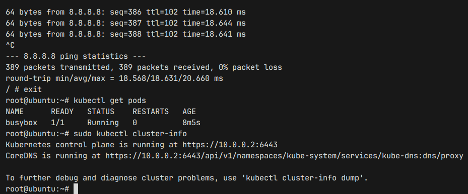

# FastAPI Weather Service

## Overview
This is a FastAPI-based weather service that retrieves weather data from the Visual Crossing Weather API. It provides temperature statistics for a given city and date range.

## Features
- Fetches weather data for a specified city and date range.
- Calculates temperature statistics (average, median, min, max).
- Uses environment variables for API configuration.
- Provides basic service information.

## Endpoints

### `GET /info`
Returns basic service information.

#### Response:
```json
{
    "version": "0.1.0",
    "service": "weather",
    "author": "y.lapshina"
}
```

### `GET /info/weather`
Retrieves weather statistics for a given city and date range.

#### Query Parameters:
- `city` (str, required): Country, city, address or coordinates.
- `date_from` (date*, optional): Start date (default: yesterday).
- `date_to` (date*, optional): End date (default: today).

*class from datetime

#### Example Request:
```bash
curl 'http://localhost:8000/info/weather?city=Saint-Petersburg&date_from=2024-02-19&date_to=2024-02-20'

```

#### Example Response:
```json
{
  "service": "weather",
  "data": {
    "temperature_c": {
      "average": -4.12,
      "median": -3,
      "min": -11,
      "max": -0.9
    }
  }
}
```

## Requirements
- Python 3.12
- `fastapi`, `Requests`


## Environment Variables
- `API_KEY`: The API key for Visual Crossing Weather API (required).
- `VERSION`: Application version (optional).
- `PORT`: Application port.

## Docker image publication
[agoneek/api-weather](https://hub.docker.com/repository/docker/agoneek/api-weather/general)

## Vagrant
- Download the `.deb` package (e.g. [hashicorp-releases](https://hashicorp-releases.mcs.mail.ru/vagrant/2.4.0/))
- Install it using dpkg:

`sudo dpkg -i ~/Downloads/<name of release>.deb `

- Download the official Ubuntu 22.04 (jammy64) Vagrant box from [here](https://portal.cloud.hashicorp.com/vagrant/discover/ubuntu/jammy64)

For other options of download, follow this [instruction](https://dunaevsky-ms.ru/posts/0053-vagrant-images/).

- Add the Ubuntu Image to Vagrant:

`vagrant box add ubuntu/jammy ~/Downloads/jammy-server-cloudimg-amd64-vagrant.box`
- Bring up your virtual machines:

`vagrant up`

### **Important**: change ansible/inventory.yml if you want to use vagrant vm

`inventory.yml` for ansible can be like this:
```
---
kube_servers:
  hosts:
    node_1:
      ansible_host: 192.168.56.2
      ansible_user: root
    node_2:
      ansible_host: 192.168.56.3
      ansible_user: root
    node_3:
      ansible_host: 192.168.56.4
      ansible_user: root

  children:
    master:
      hosts:
        node_1:
    worker:
      hosts:
        node_2:
        node_3:
  vars:
    ansible_ssh_user: vagrant
    ansible_ssh_private_key_file: ~/.vagrant.d/insecure_private_key
    ansible_python_interpreter: /usr/bin/python3

```
### **How to connect to vm with ssh?**
- `vagrant ssh <name of bm, e.g. app1>`

### **Warning: Release file is not valid**
```
[WARNING]: Failed to update cache after 5 retries due to E:Release file for http://security.ubuntu.com/ubuntu/dists/jammy-security/InRelease is not valid yet (invalid for another 10min 15s). Updates for this repository will not be applied.
```

fix:
```
sudo timedatectl set-ntp off
sudo timedatectl set-ntp on
```
check with: `date`
## Ansible
### **How to use?**

- `cd ansible/`

- `ansible-playbook --ask-pass playbook.yml`

## K8s
### **How to reinit k8s cluster?**
```
sudo kubeadm reset -f
sudo rm -rf /etc/kubernetes/
sudo rm -rf /var/lib/etcd
sudo systemctl restart kubelet
```

### **How to change INTERNAL-IP**
```
sudo nano /etc/default/kubelet
```
change this param:
```
KUBELET_EXTRA_ARGS=--node-ip=192.168.56.2
```

reload kubelet:
```
sudo systemctl restart kubelet
```

### **Helpful commands**
*from master*

get info about cluster:
```
kubectl cluster-info
```

create busybox pod and enter to it:
```
kubectl run busybox --image=busybox:1.35 --restart=Never --command -- sleep 3600
```
```
kubectl get pod busybox -o wide
```
```
kubectl exec -it busybox -- sh
```

delete busybox pod:
```
sudo kubectl delete pod busybox
```
### **Proof of Pod Network Functionality**
