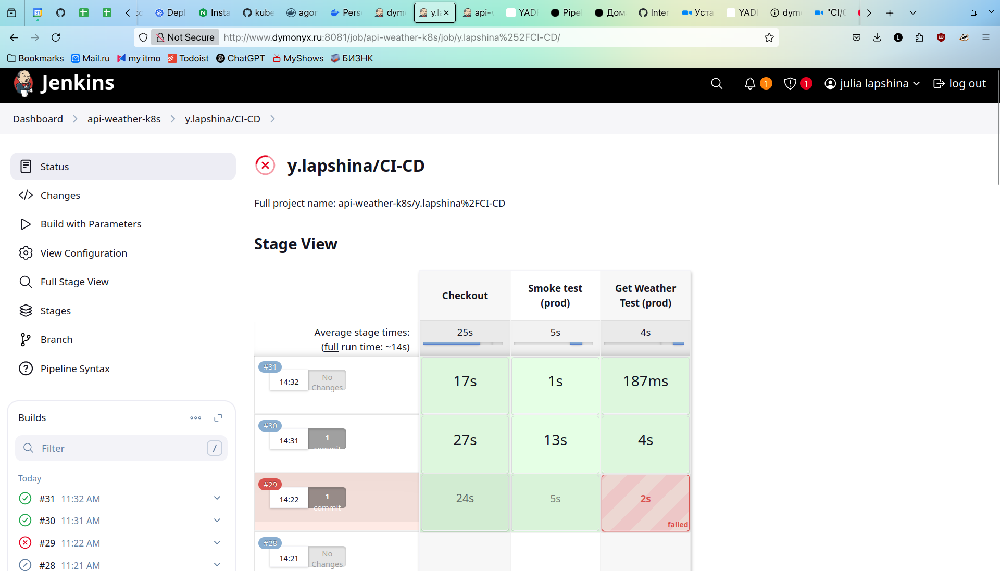

# FastAPI Weather Service

## Overview
This is a FastAPI-based weather service that retrieves weather data from the Visual Crossing Weather API. It provides temperature statistics for a given city and date range.

## Features
- Fetches weather data for a specified city and date range.
- Calculates temperature statistics (average, median, min, max).
- Uses environment variables for API configuration.
- Provides basic service information.

## Endpoints

### `GET /info`
Returns basic service information.

#### Response:
```json
{
    "version": "0.1.0",
    "service": "weather",
    "author": "y.lapshina"
}
```

### `GET /info/weather`
Retrieves weather statistics for a given city and date range.

#### Query Parameters:
- `city` (str, required): Country, city, address or coordinates.
- `date_from` (date*, optional): Start date (default: yesterday).
- `date_to` (date*, optional): End date (default: today).

*class from datetime

#### Example Request:
```bash
curl 'http://localhost:8000/info/weather?city=Saint-Petersburg&date_from=2024-02-19&date_to=2024-02-20'

```

#### Example Response:
```json
{
  "service": "weather",
  "data": {
    "temperature_c": {
      "average": -4.12,
      "median": -3,
      "min": -11,
      "max": -0.9
    }
  }
}
```

## Requirements
- Python 3.12
- `fastapi`, `Requests`


## Environment Variables
- `API_KEY`: The API key for Visual Crossing Weather API (required).
- `VERSION`: Application version (optional).
- `PORT`: Application port.

## Docker image publication
[agoneek/api-weather](https://hub.docker.com/repository/docker/agoneek/api-weather/general)

## Vagrant
- Download the `.deb` package (e.g. [hashicorp-releases](https://hashicorp-releases.mcs.mail.ru/vagrant/2.4.0/))
- Install it using dpkg:

`sudo dpkg -i ~/Downloads/<name of release>.deb `

- Download the official Ubuntu 22.04 (jammy64) Vagrant box from [here](https://portal.cloud.hashicorp.com/vagrant/discover/ubuntu/jammy64)

For other options of download, follow this [instruction](https://dunaevsky-ms.ru/posts/0053-vagrant-images/).

- Add the Ubuntu Image to Vagrant:

`vagrant box add ubuntu/jammy ~/Downloads/jammy-server-cloudimg-amd64-vagrant.box`
- Bring up your virtual machines:

`vagrant up`

### **Important**: change ansible/inventory.yml if you want to use vagrant vm

`inventory.yml` for ansible can be like this:
```
---
kube_servers:
  hosts:
    node_1:
      ansible_host: 192.168.56.2
      ansible_user: root
    node_2:
      ansible_host: 192.168.56.3
      ansible_user: root
    node_3:
      ansible_host: 192.168.56.4
      ansible_user: root

  children:
    master:
      hosts:
        node_1:
    worker:
      hosts:
        node_2:
        node_3:
  vars:
    ansible_ssh_user: vagrant
    ansible_ssh_private_key_file: ~/.vagrant.d/insecure_private_key
    ansible_python_interpreter: /usr/bin/python3

```
### **How to connect to vm with ssh?**
- `vagrant ssh <name of bm, e.g. app1>`

### **Warning: Release file is not valid**
```
[WARNING]: Failed to update cache after 5 retries due to E:Release file for http://security.ubuntu.com/ubuntu/dists/jammy-security/InRelease is not valid yet (invalid for another 10min 15s). Updates for this repository will not be applied.
```

fix:
```
sudo timedatectl set-ntp off
sudo timedatectl set-ntp on
```
check with: `date`
## Ansible
### **How to use?**

- `cd ansible/`

- `ansible-playbook --ask-pass playbook.yml`

## K8s init cluster and CNI Calico
### **How to reinit k8s cluster?**
```
sudo kubeadm reset -f
sudo rm -rf /etc/kubernetes/
sudo rm -rf /var/lib/etcd
sudo systemctl restart kubelet
```

### **How to change INTERNAL-IP**
```
sudo nano /etc/default/kubelet
```
change this param:
```
KUBELET_EXTRA_ARGS=--node-ip=192.168.56.2
```

reload kubelet:
```
sudo systemctl restart kubelet
```

### **Helpful commands**
*from master*

get info about cluster:
```
kubectl cluster-info
```

create busybox pod and enter to it:
```
kubectl run busybox --image=busybox:1.35 --restart=Never --command -- sleep 3600
```
```
kubectl get pod busybox -o wide
```
```
kubectl exec -it busybox -- sh
```

delete busybox pod:
```
sudo kubectl delete pod busybox
```
### **Proof of Pod Network Functionality**


## K8s cluster deployment

install helm: *[helm docs](https://helm.sh/docs/intro/install/)*

```
curl https://baltocdn.com/helm/signing.asc | gpg --dearmor | sudo tee /usr/share/keyrings/helm.gpg > /dev/null
sudo apt-get install apt-transport-https --yes
echo "deb [arch=$(dpkg --print-architecture) signed-by=/usr/share/keyrings/helm.gpg] https://baltocdn.com/helm/stable/debian/ all main" | sudo tee /etc/apt/sources.list.d/helm-stable-debian.list
sudo apt-get update
sudo apt-get install helm
```

install cert-manager: *[ingress-nginx and cert-manager docs](https://cert-manager.io/docs/tutorials/acme/nginx-ingress/)*

install ingress-nginx:

```
helm install ingress-nginx ingress-nginx/ingress-nginx \
  --namespace ingress-nginx \
  --create-namespace \
  --set controller.service.type=LoadBalancer
```

<!-- ```
helm repo add ingress-nginx https://kubernetes.github.io/ingress-nginx
helm repo update
helm install ingress-nginx ingress-nginx/ingress-nginx \
  --namespace ingress-nginx --create-namespace \
  --set controller.service.type=ClusterIP \
  --set controller.hostPort.enabled=true \
  --set controller.hostPort.http=8001 \
  --set controller.hostPort.https=8443

helm upgrade --install ingress-nginx ingress-nginx/ingress-nginx \
  --namespace ingress-nginx --create-namespace \
  --set controller.kind=DaemonSet \
  --set controller.service.type=ClusterIP \
  --set controller.hostPort.enabled=true \
  --set controller.hostPort.http=8001 \
  --set controller.hostPort.https=8443


helm install ingress-nginx ingress-nginx/ingress-nginx \
  --namespace ingress-nginx \
  --create-namespace \
  --set controller.kind=DaemonSet \
  --set controller.daemonset.useHostPort=true \
  --set controller.hostPort.enabled=true \
  --set controller.hostPort.http=8001 \
  --set controller.hostPort.https=8443 \
  --set controller.containerPort.http=80 \
  --set controller.containerPort.https=443 \
  --set controller.service.type="" \
  --set controller.ingressClassResource.name=nginx \
  --set controller.ingressClass=nginx

helm upgrade ingress-nginx ingress-nginx/ingress-nginx \
  -f ingress-values.yml \
  --namespace ingress-nginx
``` -->

make secrets:
```
kubectl create secret generic weather-secrets \
  --from-literal=API_KEY=your-super-secret-key \
  --from-literal=VERSION=v1.0
```

### metalb
install metallb:

```
helm install metallb metallb/metallb \
  -n metallb-system \
  --create-namespace
```

apply metallb-config (and other yml's):

```
kubectl apply -f metalb-config.yml
```

### internal server error (can't resolve dns)

edit dns at coredns config:

```
kubectl edit configmap coredns -n kube-system
```

```
forward . /etc/resolv.conf {
   max_concurrent 1000
}
```

change to

```
forward . 8.8.8.8 {
   max_concurrent 1000
}
```

```
kubectl rollout restart deployment coredns -n kube-system
```

enable Always instead of CrossSubnet VXLAN:

```
kubectl patch ippool default-ipv4-ippool --type=merge -p '{"spec":{"vxlanMode":"Always"}}'
```
### checks

check availability `api-weather-service`:

```
kubectl port-forward service/api-weather-service 8080:8080
```

check availability `aingress-nginx`:

```
kubectl port-forward ingress-nginx-controller-5b7485d6cc-756ks 8080:80 -n ingress-nginx
```

check on nodes:

```
curl http://www.dymonyx.ru/info | jq
curl -s "http://www.dymonyx.ru/info/weather?city=Saint-Petersburg&date_from=2024-02-19&date_to=2024-02-20" | jq
```

or

```
curl -H "Host: www.dymonyx.ru" http://178.170.242.27/info | jq
curl -s -H "Host: www.dymonyx.ru" "http://178.170.242.27/info/weather?city=Saint-Petersburg&date_from=2024-02-19&date_to=2024-02-20" | jq
```

or check on host out of cluster by ssh:


```
ssh -L 8080:178.170.242.27:80 root@178.170.242.27 -p 2201 -N
```

```
curl -H "Host: www.dymonyx.ru" http://localhost:8080/info | jq
```


<!-- ??????????????????/
  helm upgrade --install ingress-nginx ingress-nginx/ingress-nginx \
  -n ingress-nginx \
  --create-namespace \
  --set controller.service.type=LoadBalancer \
  --set controller.service.externalTrafficPolicy=Local \
  --set controller.nodeSelector."ingress-ready"=true \
  --set controller.replicaCount=1

helm install ingress-nginx ingress-nginx/ingress-nginx \
  -n ingress-nginx \
  --create-namespace \
  -f ingress-values-lb.yml
?????????????

helm upgrade ingress-nginx ingress-nginx/ingress-nginx \
  -n ingress-nginx \
  --set controller.service.type=LoadBalancer \
  --set controller.service.externalTrafficPolicy=Local \
  --set controller.service.ports.http=80 \
  --set controller.service.ports.https=443

ip addr add 178.170.242.27/32 dev ens3 на каждой ноде

helm upgrade ingress-nginx ingress-nginx/ingress-nginx \
  --set controller.service.type=NodePort \
  --set controller.service.externalTrafficPolicy=Cluster -->

### error when `kubectl apply -f metalb-config.yml`

***Error from server (InternalError): error when creating "metalb-config.yml": Internal error occurred: failed calling webhook "ipaddresspoolvalidationwebhook.metallb.io": failed to call webhook: Post "https://metallb-webhook-service.metallb-system.svc:443/validate-metallb-io-v1beta1-ipaddresspool?timeout=10s": context deadline exceeded***

fix:

```
helm uninstall metallb -n metallb-system
kubectl delete namespace metallb-system
```

```
helm install metallb metallb/metallb \
  --namespace metallb-system \
  --create-namespace \
  --set frr.enabled=false \
  --set speaker.frr.enabled=false
```

### if pods crash (maybe after some config changes)
```
systemctl restart kubelet
systemctl restart crio
```

## CI-CD
if you haven't enough RAM:

- use [swap](https://kubernetes.io/blog/2023/08/24/swap-linux-beta/)
- edit `/var/lib/kubelet/config.yaml` (ensure that you have only one memorySwap parameter):
```
failSwapOn: false
memorySwap:
  swapBehavior: NoSwap
evictionHard:
  memory.available: "300Mi"
systemReserved:
  memory: "300Mi"
```
- create a swap file (e.g. 4GB) and turn swap on

```
dd if=/dev/zero of=/swapfile bs=128M count=32
chmod 600 /swapfile
mkswap /swapfile
swapon /swapfile
swapon -s
```
- to start the swap file at boot time, add line like `/swapfile swap swap defaults 0 0` to `/etc/fstab` file.

- reserve memory at Linux kernel level (300MB):

```
echo "vm.min_free_kbytes = 307200" | sudo tee -a /etc/sysctl.conf
sudo sysctl -p
```

```
nano /etc/systemd/system/jenkins.service.d/override.conf
```

### kubelet is running but `kubectl get nodes` causes error

***E0411 07:22:55.959390  346795 memcache.go:265] "Unhandled Error" err="couldn't get current server API group list: Get \"https://10.0.0.2:6443/api?timeout=32s\": dial tcp 10.0.0.2:6443: connect: connection refused"***

```
mkdir -p /run/systemd/resolve
ln -sf /etc/resolv.conf /run/systemd/resolve/resolv.conf
```

### add domen for dev environment
`nano /etc/hosts`

add:
`178.170.242.27   dev.dymonyx.ru www.dymonyx.ru`

### fault tolerant ingress-controllers upgrade

```
helm upgrade ingress-nginx ingress-nginx/ingress-nginx \
  --namespace ingress-nginx \
  --set controller.replicaCount=2 \
  --set controller.affinity.podAntiAffinity.preferredDuringSchedulingIgnoredDuringExecution[0].weight=100 \
  --set controller.affinity.podAntiAffinity.preferredDuringSchedulingIgnoredDuringExecution[0].podAffinityTerm.topologyKey="kubernetes.io/hostname" \
  --set controller.affinity.podAntiAffinity.preferredDuringSchedulingIgnoredDuringExecution[0].podAffinityTerm.labelSelector.matchExpressions[0].key="app.kubernetes.io/name" \
  --set controller.affinity.podAntiAffinity.preferredDuringSchedulingIgnoredDuringExecution[0].podAffinityTerm.labelSelector.matchExpressions[0].operator="In" \
  --set controller.affinity.podAntiAffinity.preferredDuringSchedulingIgnoredDuringExecution[0].podAffinityTerm.labelSelector.matchExpressions[0].values[0]="ingress-nginx"
  <!-- --set controller.scope.enabled=false
  --set controller.service.externalTrafficPolicy=Local \ -->
```

make secrets for dev ns:
```
kubectl create secret generic weather-secrets \
  --from-literal=API_KEY=your-super-secret-key \
  --from-literal=VERSION=v1.0
  -n dev
```

## Demo
check app pods:

```
kubectl get pods -o wide
```
check app availability:

```
curl http://www.dymonyx.ru/info | jq
curl -s "http://www.dymonyx.ru/info/weather?city=Saint-Petersburg&date_from=2024-02-19&date_to=2024-02-20" | jq
```

get config for show probes:

```
kubectl get deployment api-weather-deployment -o yaml
```
CI/CD (unfortunately, only for prod test, but the whole pipeline available in Jenkinsfile):

